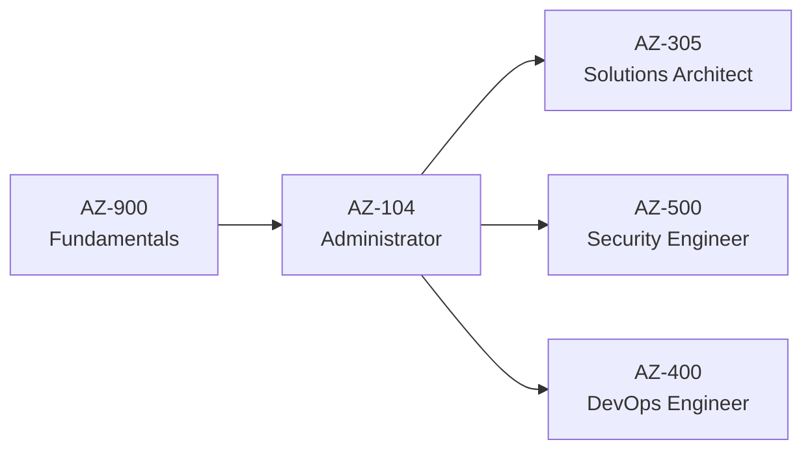

# AZ-104: Azure Administrator

> **Exam version**: Skills measured as of April 17, 2026 | **Passing score**: 700/1000 | **Duration**: ~100-120 minutes

## Who is this for?

As a candidate for this certification, you should have subject matter expertise in implementing, managing, and monitoring an organization's Microsoft Azure environment, including virtual networks, storage, compute, identity, security, and governance.

## Skills at a Glance

| Domain | Weight | Challenges |
|--------|--------|------------|
| Manage Azure identities and governance | 20–25% | 01, 02, 03 |
| Implement and manage storage | 15–20% | 04, 05, 06 |
| Deploy and manage Azure compute resources | 20–25% | 07, 08, 09, 10 |
| Implement and manage virtual networking | 15–20% | 11, 12, 13 |
| Monitor and maintain Azure resources | 10–15% | 14, 15 |
| Cross-domain capstone | All | 16 |

## How This Site Works

Each challenge follows a consistent format:

1. **Introduction** | Real-world scenario that frames the challenge
2. **Exam Skills Covered** | Exact bullets from the official study guide
3. **Description** | Your mission with step-by-step tasks
4. **Success Criteria** | Clear "done" definition
5. **Multi-Tool Tabs** | Azure CLI, PowerShell, and Portal instructions
6. **Hints** | Expandable hints if you get stuck
7. **Break & Fix** | Troubleshooting scenarios with deliberate misconfigurations
8. **Knowledge Check** | Exam-style questions to test yourself
9. **Cleanup** | Scripts to delete resources and avoid costs

## Prerequisites

- **Azure subscription** — [Azure Free Account](https://azure.microsoft.com/free/) ($200 credit for 30 days) or [Azure for Students](https://azure.microsoft.com/free/students/) ($100 credit, no credit card)
- **Familiarity with** — Operating systems, networking basics, servers, virtualization
- **Experience with** — Azure Portal, command-line tools (CLI or PowerShell)

:::tip One-Click Lab

No setup needed! [Open in GitHub Codespaces](https://codespaces.new/azurecertprep/azurecertprep.github.io?quickstart=1) and get Azure CLI, Bicep, and PowerShell ready in minutes. Free for 60h/month.
:::

## Study Resources

| Resource | Link |
|----------|------|
| Official Study Guide | [AZ-104 Study Guide](https://learn.microsoft.com/en-us/credentials/certifications/resources/study-guides/az-104) |
| Instructor-Led Course | [AZ-104T00 Course](https://learn.microsoft.com/en-us/training/courses/az-104t00) |
| Free Practice Assessment | [Practice Questions](https://learn.microsoft.com/en-us/credentials/certifications/exams/az-104/practice/assessment?assessment-type=practice&assessmentId=21) |
| Exam Sandbox | [Try the exam interface](https://aka.ms/examdemo) |
| Schedule the Exam | [Pearson VUE](https://learn.microsoft.com/en-us/credentials/certifications/azure-administrator/) |

## Microsoft Learn Paths

The official Microsoft Learn self-paced content for AZ-104:

| Learning Path | Modules |
|---------------|---------|
| [Prerequisites for Azure administrators](https://learn.microsoft.com/en-us/training/paths/az-104-administrator-prerequisites/) | 2 |
| [Manage identities and governance in Azure](https://learn.microsoft.com/en-us/training/paths/az-104-manage-identities-governance/) | 6 |
| [Configure and manage virtual networks](https://learn.microsoft.com/en-us/training/paths/az-104-manage-virtual-networks/) | 8 |
| [Implement and manage storage in Azure](https://learn.microsoft.com/en-us/training/paths/az-104-manage-storage/) | 4 |
| [Deploy and manage Azure compute resources](https://learn.microsoft.com/en-us/training/paths/az-104-manage-compute-resources/) | 5 |
| [Monitor and back up Azure resources](https://learn.microsoft.com/en-us/training/paths/az-104-monitor-backup-resources/) | 3 |

## Learning Path

---

**Ready?** Start with the [Am I Ready?](/docs/az-104/self-assessment) self-assessment or jump straight to the [Lab Setup](/docs/az-104/lab-setup).
