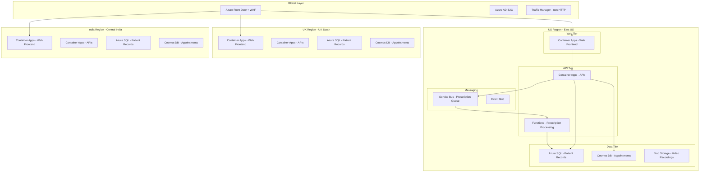

import SuccessChecklist from '@site/src/components/SuccessChecklist';

# Challenge 50: design a complete Azure solution (Cross-Domain capstone)

:::info Estimated Time and Cost

**120-180 min** | **Estimated cost**: $15-40 | **Exam Weight: ALL DOMAINS**

:::

## Introduction

MediCorp is a healthcare technology company launching a new telemedicine platform that will serve 500,000 patients and 5,000 doctors across 3 countries: United States, United Kingdom, and India. The platform will enable video consultations, manage patient records, process prescriptions, handle appointment scheduling, and provide real-time analytics dashboards.

This is a greenfield deployment with aggressive timelines (MVP in 6 months, full launch in 12 months) and strict requirements across every architectural dimension. The platform must comply with HIPAA (US), UK GDPR (UK), and India's Digital Personal Data Protection Act. All patient health information (PHI) must be encrypted at rest and in transit, access must be audited, and data must reside in the region where the patient is located.

The business requirements include:
- **Video Consultations**: Real-time, low-latency video between patient and doctor, recorded for compliance and potential dispute resolution. Must support 5,000 concurrent video sessions at peak.
- **Patient Records (EHR)**: Electronic health records accessible by authorized doctors only, with full audit trail of every access. 500,000 patient records with medical history, lab results, imaging references.
- **Prescription System**: Exactly-once processing guarantee (no duplicate prescriptions), integrated with pharmacy systems via API, complete audit trail for regulatory compliance.
- **Appointment Scheduling**: High availability (no single point of failure), handles 10,000 concurrent users during peak morning booking hours, supports multiple time zones.
- **Analytics Dashboard**: Real-time metrics showing patient wait times, doctor utilization rates, consultation duration, and platform health. Used by operations team for capacity planning.
- **SLA**: 99.99% availability for the critical path (appointment booking through consultation through prescription)
- **Disaster Recovery**: RPO 5 seconds, RTO 2 minutes for critical systems (appointment, consultation, prescription)
- **Budget**: $50,000/month total Azure spend
- **Security**: No public endpoints for backend services, all secrets in Key Vault, managed identity for all service-to-service authentication, zero-trust network architecture

This capstone challenge integrates all 4 exam domains: Identity/Governance/Monitoring, Data Storage, Business Continuity, and Infrastructure. Design the complete architecture.

## Exam skills covered

- Design solutions for logging and monitoring
- Design authentication and authorization solutions
- Design governance
- Design data storage solutions for relational data
- Design data storage solutions for semi-structured and unstructured data
- Design solutions for backup and disaster recovery
- Design for high availability
- Recommend a compute solution based on workload requirements
- Recommend a messaging architecture
- Recommend a caching solution for applications
- Recommend a connectivity solution that connects Azure resources to the internet
- Recommend a solution to optimize network security
- Recommend a load-balancing and routing solution

## Design tasks

### Part 1: identity, governance, and monitoring (Domain 1)

1. Design the identity architecture:
   - Patient authentication: Azure AD B2C with multi-factor authentication, social identity providers, self-service password reset
   - Doctor authentication: Entra ID with Conditional Access (require compliant device, MFA, restrict to approved locations)
   - Service-to-service: Managed Identity for all Azure services (no credentials in code)
   - Authorization: Role-based access control (patients see own records, doctors see assigned patients, admin sees analytics)
2. Design the governance structure:
   - Management group and subscription layout (separate subscriptions for production/non-production, or per-region?)
   - Azure Policy assignments: enforce encryption, restrict public endpoints, require diagnostic settings, enforce tagging
   - Resource naming convention and tagging strategy (cost allocation by department, environment, compliance scope)
3. Design the monitoring and observability strategy:
   - Application Insights for each microservice (distributed tracing across video, scheduling, prescription services)
   - Log Analytics workspace strategy (single workspace vs. per-region for data residency compliance)
   - Azure Monitor alerts for SLA tracking (availability, latency, error rate per service)
   - Custom dashboards for operations team (real-time patient wait times, doctor utilization, platform health)
   - Audit logging for compliance (who accessed which patient record, when, from where)

### Part 2: Data Storage design (Domain 2)

4. Design the data storage architecture for each data type:
   - Patient records (structured, relational): Azure SQL Database or Cosmos DB? Consider query patterns, consistency requirements, and multi-region needs
   - Video recordings (large blobs, write-once): Azure Blob Storage with immutable policies for compliance
   - Appointment data (high-throughput reads/writes, multi-region): Cosmos DB with appropriate consistency level
   - Prescription audit trail (append-only, high-write, regulatory retention): Cosmos DB or Azure Table Storage?
   - Analytics data (time-series, aggregations): Azure Data Explorer or dedicated analytics store
5. Design the data residency strategy:
   - US patient data in East US region
   - UK patient data in UK South region
   - India patient data in Central India region
   - Cross-region doctor access (a US doctor consulting a UK patient - how is data served?)
6. Design data protection:
   - Encryption at rest (customer-managed keys in Key Vault for PHI)
   - Encryption in transit (TLS 1.3 minimum for all connections)
   - Data masking for non-production environments
   - Backup and retention policies (7-year retention for medical records per regulation)

### Part 3: Business continuity design (Domain 3)

7. Design the high availability architecture for 99.99% SLA:
   - Calculate composite SLA across all services in the critical path
   - Identify single points of failure and eliminate them
   - Multi-region active-active for appointment and consultation services
   - Zone-redundant deployments for all stateful services
8. Design the disaster recovery strategy:
   - RPO 5 seconds: which data replication method achieves this? (Cosmos DB multi-region write, Azure SQL active geo-replication with async commit)
   - RTO 2 minutes: what failover mechanism achieves this? (Azure Front Door health probes, automated failover groups)
   - Document the failover sequence for the critical path: DNS rerouting, database failover, session re-establishment
9. Design backup strategy for each data store:
   - Azure SQL: automated backups, point-in-time restore, long-term retention (7 years)
   - Cosmos DB: continuous backup mode with point-in-time restore
   - Blob Storage: soft delete, versioning, immutability policies for compliance
   - Document RPO/RTO for non-critical systems (analytics: RPO 1 hour, RTO 4 hours)

### Part 4: infrastructure and compute design (Domain 4)

10. Design the compute architecture:
    - Video consultation service: what compute platform handles 5,000 concurrent WebRTC sessions? (Azure Communication Services or custom media server on AKS?)
    - Appointment scheduling API: high-concurrency, stateless (Azure Container Apps with autoscaling?)
    - Prescription processing: exactly-once semantics, message ordering (Azure Functions with Service Bus?)
    - Background jobs: video transcoding, report generation (Azure Container Apps jobs or Azure Batch?)
11. Design the messaging and event architecture:
    - Appointment events: patient books, doctor confirms, reminder sent (Event Grid or Service Bus?)
    - Prescription workflow: request -> validate -> approve -> send to pharmacy (Service Bus with sessions for ordering)
    - Video recording events: consultation ends -> recording saved -> transcription triggered -> stored (Event Grid + Storage Events)
12. Design the network architecture:
    - Azure Front Door for global load balancing with WAF
    - Private Endpoints for all PaaS services
    - VNet integration for Container Apps and Functions
    - Network segmentation: web tier, API tier, data tier with NSGs
    - No public internet exposure for any backend service

### Part 5: architecture diagram

13. Create a comprehensive architecture diagram (using the Mermaid diagram block below as a starting template) that shows:
    - All Azure services selected
    - Network boundaries and security zones
    - Data flow for the critical path (appointment -> consultation -> prescription)
    - Multi-region deployment topology
    - Identity and access control boundaries



### Part 6: Well-Architected Framework assessment

14. Evaluate your design against each pillar of the Azure Well-Architected Framework:

**Reliability Pillar:**
- How does the architecture achieve 99.99% SLA?
- What happens when a region fails? Document the failover sequence.
- Are there any single points of failure remaining?

**Security Pillar:**
- How is patient data protected (encryption, access control, network isolation)?
- How is zero-trust implemented (verify explicitly, least privilege, assume breach)?
- How are compliance requirements (HIPAA, GDPR) addressed architecturally?

**Cost Optimization Pillar:**
- Does the design fit within the $50K/month budget?
- What auto-scaling strategies reduce cost during off-peak hours?
- Where can reserved instances or savings plans reduce compute cost?

**Operational Excellence Pillar:**
- How is the platform deployed and updated (CI/CD, blue-green, canary)?
- How does the operations team detect and respond to incidents?
- What runbooks exist for common failure scenarios?

**Performance Efficiency Pillar:**
- How is video consultation latency minimized for cross-country calls?
- How does appointment scheduling handle 10,000 concurrent users?
- What caching strategy reduces database load?

### Part 7: cost estimation

15. Produce a monthly cost estimate broken down by service category:
    - Compute (Container Apps, Functions, AKS if used)
    - Data (Azure SQL, Cosmos DB, Blob Storage)
    - Networking (Front Door, VPN/ExpressRoute, bandwidth egress)
    - Security (DDoS Protection, WAF, Key Vault)
    - Monitoring (Application Insights, Log Analytics)
    - Identity (Azure AD B2C transactions)
    - Verify total fits within $50K/month budget
    - Identify cost optimization opportunities (reserved capacity, autoscale-to-zero, tiered storage)

## Success criteria

<SuccessChecklist
  storageKey="az305-challenge-50"
  items={[
    "Identity architecture covers patient B2C auth, doctor Entra ID auth, and managed identity for service-to-service with RBAC",
    "Data storage design addresses relational (SQL), document (Cosmos DB), blob, and analytics data with data residency enforcement",
    "High availability design achieves 99.99% composite SLA with no single points of failure in the critical path",
    "DR design meets RPO 5 seconds and RTO 2 minutes with documented failover sequence for critical systems",
    "Network architecture enforces zero public endpoints for backend services with Private Endpoints and VNet integration",
    "Architecture diagram shows all services, network boundaries, data flow, and multi-region topology"
  ]}
/>

## Hints

<details>
<summary>Hint 1: Composite SLA Calculation</summary>

For 99.99% composite SLA, each service in the critical path must exceed 99.99% individually, or you must add redundancy. Azure Container Apps SLA is 99.95%, Azure SQL Business Critical is 99.995%, Cosmos DB multi-region is 99.999%, Service Bus Premium is 99.9%. The critical path SLA = product of all services: 0.9995 x 0.99995 x 0.99999 x 0.999 = approximately 99.84%. To achieve 99.99%, add multi-region redundancy for the weakest links (Container Apps in 2 regions with Front Door = 1 - (1 - 0.9995)^2 = 99.999975%).

</details>

<details>
<summary>Hint 2: Video Consultation Architecture</summary>

Azure Communication Services (ACS) provides managed real-time video, voice, and chat capabilities. It handles the WebRTC complexity (TURN/STUN servers, bandwidth adaptation, recording). For 5,000 concurrent sessions, ACS scales automatically. Recording is stored in Azure Blob Storage. Alternatively, if you need custom media processing, deploy a media server on AKS, but this requires significant operational effort. For most telemedicine scenarios, ACS is the recommended approach as it provides HIPAA-eligible video with built-in recording and compliance features.

</details>

<details>
<summary>Hint 3: Exactly-Once Prescription Processing</summary>

True exactly-once processing requires idempotent message handlers combined with Service Bus PeekLock and deduplication. Design: (1) Prescription request published to Service Bus queue with a unique PrescriptionId, (2) Function triggered by queue picks up message, (3) Function checks if PrescriptionId already processed (idempotency check against database), (4) If new, processes and completes the message; if duplicate, completes without processing, (5) If processing fails, message returns to queue after lock expires and is retried. Enable duplicate detection on Service Bus (deduplication window) for publish-side deduplication.

</details>

<details>
<summary>Hint 4: Data Residency with Multi-Region Access</summary>

Store patient data in the patient's region (mandatory for GDPR/HIPAA). When a US doctor needs to see a UK patient's record, the API in the US region makes a cross-region call to the UK region's API (not directly to the UK database). This keeps the data access auditable, ensures data does not replicate outside its region, and allows region-specific authorization policies. Use Azure Front Door to route patient requests to their home region based on geographic routing rules or authentication claims (patient's registered country).

</details>

<details>
<summary>Hint 5: Budget Optimization for $50K/month</summary>

Key cost drivers in this architecture: Cosmos DB multi-region (use autoscale to minimize RU costs), Azure SQL Business Critical (consider General Purpose with zone redundancy for non-critical regions), Container Apps (scale to zero for non-peak hours), Video recording storage (use Cool/Archive tier after 30 days), Azure Communication Services (per-minute billing for video). Use Azure Pricing Calculator to estimate: expect roughly $15K compute, $15K data, $8K networking/security, $5K monitoring, $7K other services. Reserved capacity for predictable workloads (SQL, Cosmos DB) can save 30-40%.

</details>

## Learning resources

- [Azure Well-Architected Framework](https://learn.microsoft.com/en-us/azure/well-architected/)
- [Azure Architecture Center - Healthcare](https://learn.microsoft.com/en-us/azure/architecture/industries/healthcare)
- [Azure Communication Services overview](https://learn.microsoft.com/en-us/azure/communication-services/overview)
- [Azure AD B2C overview](https://learn.microsoft.com/en-us/azure/active-directory-b2c/overview)
- [Cosmos DB multi-region writes](https://learn.microsoft.com/en-us/azure/cosmos-db/how-to-multi-master)
- [Azure SQL auto-failover groups](https://learn.microsoft.com/en-us/azure/azure-sql/database/auto-failover-group-overview)
- [HIPAA compliance on Azure](https://learn.microsoft.com/en-us/azure/compliance/offerings/offering-hipaa-us)
- [Azure Front Door with Private Link origins](https://learn.microsoft.com/en-us/azure/frontdoor/private-link)

## Knowledge check

<details>
<summary>1. Your architecture uses Cosmos DB with multi-region writes for appointment scheduling (99.999% SLA) and Azure Container Apps for the API tier (99.95% SLA). The critical path goes through both. What is the composite SLA and how do you improve it?</summary>

**Composite SLA is 99.949% (0.99999 x 0.9995).** The Container Apps SLA is the bottleneck. To achieve 99.99%: deploy Container Apps in 2 regions with Azure Front Door routing. The effective Container Apps availability becomes 1 - (1 - 0.9995)^2 = 99.999975%. New composite SLA: 0.99999975 x 0.99999 = 99.999%. This exceeds the 99.99% target. The principle: the weakest SLA in a serial chain determines the composite; adding parallel redundancy for the weakest link dramatically improves overall availability.

</details>

<details>
<summary>2. A UK patient's records are stored in UK South. A doctor in India needs to access those records for an emergency consultation. Your data residency policy prevents replicating UK patient data to India. How do you architect this access?</summary>

**The India API tier makes an authenticated cross-region API call to the UK API tier, which reads from the UK database.** Flow: (1) Doctor in India authenticates and requests patient record, (2) India API determines data residency is UK, (3) India API calls UK API (service-to-service auth via managed identity), (4) UK API verifies authorization (doctor is assigned to this patient, emergency override is valid), (5) UK API returns data to India API, (6) India API streams to doctor. Data never leaves UK storage; only the API response crosses regions. This maintains data residency compliance while enabling global access. Audit log captures the cross-region access event.

</details>

<details>
<summary>3. During peak morning hours (8-10 AM across 3 time zones), appointment scheduling handles 10,000 concurrent users. By 2 PM, traffic drops to 500 concurrent users. How do you design for cost efficiency while maintaining performance?</summary>

**Use Container Apps with HTTP-based autoscaling and scale-to-zero for non-critical components.** Design: (1) Container Apps with min replicas = 3 (ensures baseline availability) and max replicas = 50 (handles peak), KEDA HTTP scaler based on concurrent requests, (2) Cosmos DB autoscale (set max RU/s for peak, automatically scales down to 10% during off-peak, billed per actual consumption), (3) Azure SQL serverless for analytics databases (auto-pause after 1 hour of inactivity), (4) Pre-warm strategy: scheduled scaling rule that increases min replicas to 10 at 7:30 AM each time zone to avoid cold-start latency during the morning ramp-up.

</details>

<details>
<summary>4. The prescription system requires exactly-once delivery, but your Service Bus consumer function occasionally fails mid-processing (after writing to the database but before completing the message). How do you prevent duplicate prescriptions?</summary>

**Implement idempotent processing with a deduplication table.** Design: (1) Service Bus message contains a unique PrescriptionId, (2) Before processing, the function checks a Prescriptions table for an existing record with that PrescriptionId (idempotency guard), (3) If found, the prescription was already processed in a previous attempt - complete the message without re-processing, (4) If not found, process the prescription within a database transaction (insert prescription + mark as processed), then complete the message. Additionally, enable Service Bus duplicate detection (MessageId-based deduplication window) to prevent the same prescription request from being enqueued twice. The combination of publish-side deduplication and consume-side idempotency achieves effective exactly-once semantics.

</details>

## Validation lab

Deploy a minimal proof-of-concept to validate your design:

1. Create a resource group for this lab:

```bash
az group create --name rg-az305-challenge50 --location eastus
```

2. Create a VNet with subnets for App Service integration and private endpoints:

```bash
az network vnet create --resource-group rg-az305-challenge50 \
  --name vnet-lab50 --address-prefix 10.0.0.0/16 \
  --subnet-name subnet-appservice --subnet-prefix 10.0.1.0/24

az network vnet subnet create --resource-group rg-az305-challenge50 \
  --vnet-name vnet-lab50 --name subnet-pe --address-prefix 10.0.2.0/24 \
  --disable-private-endpoint-network-policies true
```

3. Create an App Service with VNet integration:

```bash
az appservice plan create --resource-group rg-az305-challenge50 \
  --name plan-lab50 --sku S1 --is-linux

az webapp create --resource-group rg-az305-challenge50 \
  --plan plan-lab50 --name webapp-lab50-$(openssl rand -hex 4) \
  --runtime "NODE:20-lts"

WEBAPP_NAME=$(az webapp list --resource-group rg-az305-challenge50 \
  --query "[0].name" -o tsv)

az webapp vnet-integration add --resource-group rg-az305-challenge50 \
  --name $WEBAPP_NAME --vnet vnet-lab50 --subnet subnet-appservice
```

4. Create a Key Vault with a private endpoint:

```bash
az keyvault create --resource-group rg-az305-challenge50 \
  --name kv-lab50-$(openssl rand -hex 4) --location eastus \
  --public-network-access Disabled

KV_ID=$(az keyvault list --resource-group rg-az305-challenge50 \
  --query "[0].id" -o tsv)

az network private-endpoint create --resource-group rg-az305-challenge50 \
  --name pe-keyvault50 --vnet-name vnet-lab50 --subnet subnet-pe \
  --private-connection-resource-id $KV_ID \
  --group-id vault --connection-name conn-vault
```

5. Verify the App Service VNet integration and private endpoint:

```bash
az webapp vnet-integration list --resource-group rg-az305-challenge50 \
  --name $WEBAPP_NAME -o table

az network private-endpoint show --resource-group rg-az305-challenge50 \
  --name pe-keyvault50 \
  --query "privateLinkServiceConnections[0].privateLinkServiceConnectionState.status" -o tsv
```

:::tip
This mini-deployment validates your design decisions with real Azure resources. It is optional but recommended.
:::

## Cleanup

```bash
# Delete all resources created in this capstone challenge
# IMPORTANT: this challenge may have created resources across multiple regions
az group delete --name rg-az305-challenge50-eastus --yes --no-wait
az group delete --name rg-az305-challenge50-uksouth --yes --no-wait
az group delete --name rg-az305-challenge50-centralindia --yes --no-wait

# Verify no orphaned resources remain
az group list --query "[?starts_with(name, 'rg-az305-challenge50')]" -o table
```
