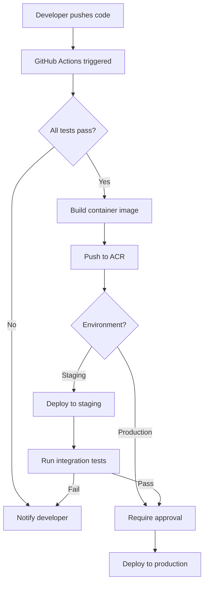
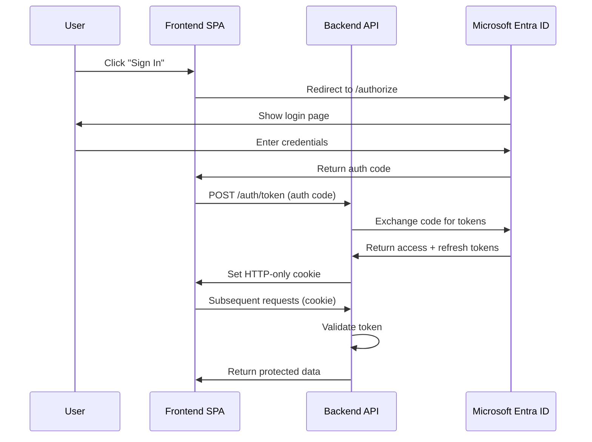
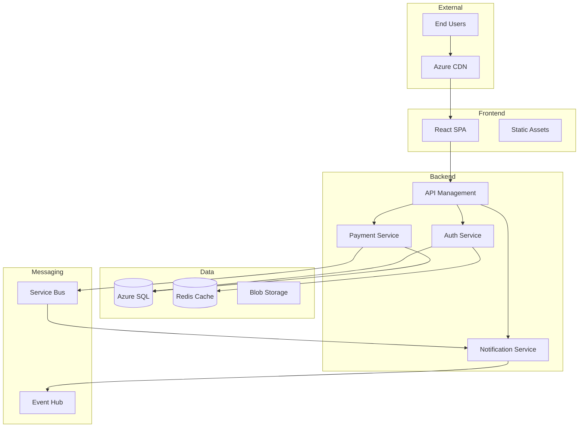
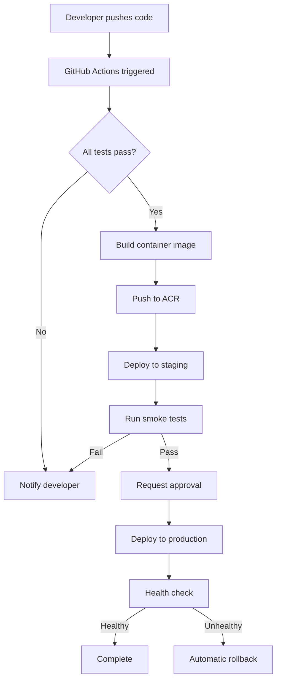
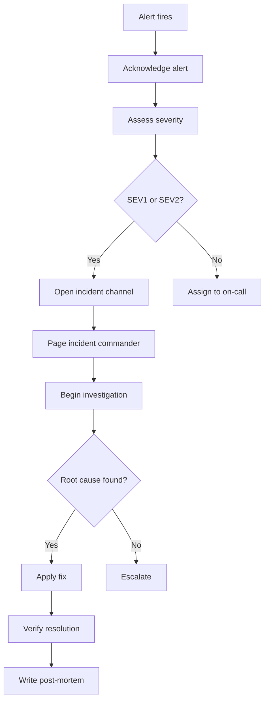

# Challenge 05: Documentation and collaboration

## Exam skills covered

- Document a project by configuring wikis and process diagrams, including Markdown and Mermaid syntax
- Configure release documentation, including release notes and API documentation
- Automate creation of documentation from Git history

## Platform focus

Comparison (GitHub and Azure DevOps)

## Scenario

Contoso Ltd has no documentation standards. When a new developer joins, they spend their first two weeks asking questions that should have been answered by onboarding docs. Release notes are manual emails that the PM writes from memory after each deployment. The API documentation consists of outdated Word documents on a SharePoint site that nobody updates. Architecture diagrams were created in Visio three years ago and no longer reflect reality. The Engineering Director wants documentation that lives alongside code, updates automatically where possible, and follows a consistent structure.

---

## Prerequisites

- A GitHub repository (`contoso-webapp`) with active development history
- An Azure DevOps project with pipelines configured
- GitHub CLI installed and authenticated
- Node.js installed (for documentation tooling)
- Basic familiarity with Markdown syntax

---

## Task 1: Set up Azure DevOps Wiki (code wiki vs provisioned wiki)

Azure DevOps offers two wiki types with different use cases:

### Provisioned wiki

A wiki managed entirely within Azure DevOps. Best for team documentation that does not need to live in a code repository.

```bash
# Create a provisioned wiki
az devops wiki create \
  --name "Contoso Engineering Wiki" \
  --type projectWiki \
  --org https://dev.azure.com/contoso-org \
  --project "Contoso Web Platform"

# Add a page to the wiki
az devops wiki page create \
  --wiki "Contoso Engineering Wiki" \
  --path "Home" \
  --content "# Contoso Engineering Wiki

Welcome to the Contoso engineering knowledge base.

## Quick links

- [Architecture Overview](/Architecture-Overview)
- [Onboarding Guide](/Onboarding-Guide)
- [API Reference](/API-Reference)
- [Runbooks](/Runbooks)
"

# Add a sub-page
az devops wiki page create \
  --wiki "Contoso Engineering Wiki" \
  --path "Onboarding-Guide" \
  --content "# Onboarding guide

## First week checklist

1. Set up development environment (see [Dev Setup](/Dev-Setup))
2. Complete security training
3. Read the architecture overview
4. Shadow a team member on a PR review
5. Complete your first small task

## Access requests

| System | How to request | Approver |
|--------|----------------|----------|
| GitHub org | IT ticket | Engineering Manager |
| Azure subscription | PIM request | Team Lead |
| Production VPN | Security team | CISO |
"
```

### Code wiki (published from repository)

A wiki backed by a Git repository or a folder within one. Best for documentation that should be version-controlled alongside code.

```bash
# Publish a folder from an existing repo as a wiki
az devops wiki create \
  --name "Contoso API Docs" \
  --type codeWiki \
  --repository "contoso-webapp" \
  --mapped-path "/docs" \
  --branch "main" \
  --org https://dev.azure.com/contoso-org \
  --project "Contoso Web Platform"
```

### Key differences

| Aspect | Provisioned wiki | Code wiki |
|--------|-----------------|-----------|
| Storage | Azure DevOps internal Git repo | Your repository |
| Version control | Automatic (internal) | Standard Git workflow |
| Branch support | Single branch | Any branch |
| PR reviews for changes | Not built-in | Standard PR process |
| Access control | Wiki permissions | Repository permissions |
| Best for | Team knowledge base | Technical docs alongside code |

---

## Task 2: Create Mermaid diagrams in Markdown

Mermaid diagrams render natively in GitHub Markdown and Azure DevOps Wiki. They are ideal for keeping diagrams in sync with code because they are text-based and diffable.

### Flowchart: deployment pipeline

````markdown

````

### Sequence diagram: authentication flow

````markdown

````

### Architecture diagram: system overview

````markdown

````

### Add diagrams to the repository

```bash
mkdir -p docs/architecture

cat > docs/architecture/deployment-pipeline.md << 'EOF'
# Deployment pipeline

The following diagram shows our CI/CD pipeline from code push to production deployment.



## Pipeline stages

| Stage | Duration | Automated |
|-------|----------|-----------|
| Build and test | ~5 min | Yes |
| Container build | ~3 min | Yes |
| Staging deploy | ~2 min | Yes |
| Smoke tests | ~5 min | Yes |
| Production approval | Variable | No (manual gate) |
| Production deploy | ~2 min | Yes |
| Health check | ~1 min | Yes |
EOF

git add docs/
git commit -m "docs: add architecture diagrams with Mermaid"
git push origin main
```

---

## Task 3: Auto-generate release notes from PR titles

### Using GitHub release-drafter

```bash
# Create release-drafter configuration
mkdir -p .github

cat > .github/release-drafter.yml << 'EOF'
name-template: 'v$RESOLVED_VERSION'
tag-template: 'v$RESOLVED_VERSION'
template: |
  ## What changed

  $CHANGES

  ## Contributors

  $CONTRIBUTORS

categories:
  - title: 'New features'
    labels:
      - 'enhancement'
      - 'feature'
  - title: 'Bug fixes'
    labels:
      - 'bug'
      - 'bugfix'
  - title: 'Performance'
    labels:
      - 'performance'
  - title: 'Security'
    labels:
      - 'security'
  - title: 'Documentation'
    labels:
      - 'documentation'
  - title: 'Dependencies'
    labels:
      - 'dependencies'
  - title: 'Other changes'
    labels:
      - '*'

version-resolver:
  major:
    labels:
      - 'breaking-change'
  minor:
    labels:
      - 'enhancement'
      - 'feature'
  patch:
    labels:
      - 'bug'
      - 'bugfix'
      - 'documentation'
      - 'dependencies'
  default: patch

autolabeler:
  - label: 'documentation'
    files:
      - '*.md'
      - 'docs/**'
  - label: 'bug'
    branch:
      - '/^bugfix\//'
      - '/^fix\//'
  - label: 'enhancement'
    branch:
      - '/^feature\//'
  - label: 'dependencies'
    files:
      - 'package-lock.json'
      - 'package.json'

exclude-labels:
  - 'skip-changelog'
EOF

# Create the workflow to run release-drafter
cat > .github/workflows/release-drafter.yml << 'EOF'
name: Release drafter

on:
  push:
    branches: [main]
  pull_request:
    types: [opened, reopened, synchronize]

permissions:
  contents: read
  pull-requests: write

jobs:
  update-release-draft:
    runs-on: ubuntu-latest
    permissions:
      contents: write
      pull-requests: write
    steps:
      - uses: release-drafter/release-drafter@v6
        env:
          GITHUB_TOKEN: ${{ secrets.GITHUB_TOKEN }}
EOF

git add .github/release-drafter.yml .github/workflows/release-drafter.yml
git commit -m "ci: add release-drafter for automated release notes"
git push origin main
```

### Creating a release manually with auto-generated notes

```bash
# GitHub can auto-generate notes from merged PRs
gh release create v2.4.0 \
  --title "v2.4.0 - Authentication Overhaul" \
  --generate-notes \
  --target main

# Or with a custom notes file
gh release create v2.4.0 \
  --title "v2.4.0 - Authentication Overhaul" \
  --notes-file RELEASE_NOTES.md \
  --target main
```

---

## Task 4: Auto-generate changelog from conventional commits

### Install and configure conventional-changelog

```bash
# Install the conventional-changelog CLI
npm install --save-dev conventional-changelog-cli

# Generate a changelog from Git history
npx conventional-changelog -p angular -i CHANGELOG.md -s -r 0

# Add a script to package.json
cat > package.json << 'EOF'
{
  "name": "contoso-webapp",
  "version": "2.4.0",
  "scripts": {
    "changelog": "conventional-changelog -p angular -i CHANGELOG.md -s",
    "changelog:all": "conventional-changelog -p angular -i CHANGELOG.md -s -r 0",
    "version": "conventional-changelog -p angular -i CHANGELOG.md -s && git add CHANGELOG.md"
  },
  "devDependencies": {
    "conventional-changelog-cli": "^4.1.0"
  }
}
EOF
```

### Automate changelog generation in CI

```bash
cat > .github/workflows/changelog.yml << 'EOF'
name: Generate changelog

on:
  push:
    tags:
      - 'v*'

permissions:
  contents: write

jobs:
  changelog:
    runs-on: ubuntu-latest
    steps:
      - uses: actions/checkout@v4
        with:
          fetch-depth: 0

      - name: Setup Node.js
        uses: actions/setup-node@v4
        with:
          node-version: '20'

      - name: Install dependencies
        run: npm install conventional-changelog-cli

      - name: Generate changelog
        run: npx conventional-changelog -p angular -i CHANGELOG.md -s -r 0

      - name: Commit updated changelog
        run: |
          git config user.name "github-actions[bot]"
          git config user.email "github-actions[bot]@users.noreply.github.com"
          git add CHANGELOG.md
          git commit -m "docs: update changelog for ${{ github.ref_name }}" || true
          git push origin HEAD:main
EOF

git add .github/workflows/changelog.yml package.json
git commit -m "ci: add automated changelog generation from conventional commits"
git push origin main
```

### Example changelog output

```markdown
# Changelog

## 2.4.0 (2025-01-20)

### Features

* **auth:** implement SSO login with Microsoft Entra ID (a1b2c3d)
* **auth:** add token refresh logic (d4e5f6a)
* **api:** add rate limiting middleware (b7c8d9e)

### Bug Fixes

* **payments:** correct decimal precision in currency conversion (f0a1b2c)
* **payments:** handle gateway timeout gracefully (c3d4e5f)

### Performance

* **api:** add Redis caching for user sessions (a6b7c8d)

### Breaking Changes

* **api:** change authentication endpoint response format (e9f0a1b)
```

---

## Task 5: Set up API documentation with Swagger/OpenAPI auto-publish

### Generate OpenAPI spec from code annotations

```bash
mkdir -p src/api

# Example Express API with JSDoc annotations for swagger-jsdoc
cat > src/api/users.js << 'EOF'
const express = require('express');
const router = express.Router();

/**
 * @openapi
 * /api/users:
 *   get:
 *     summary: List all users
 *     tags: [Users]
 *     parameters:
 *       - in: query
 *         name: page
 *         schema:
 *           type: integer
 *           default: 1
 *         description: Page number
 *       - in: query
 *         name: limit
 *         schema:
 *           type: integer
 *           default: 20
 *         description: Items per page
 *     responses:
 *       200:
 *         description: List of users
 *         content:
 *           application/json:
 *             schema:
 *               type: object
 *               properties:
 *                 data:
 *                   type: array
 *                   items:
 *                     $ref: '#/components/schemas/User'
 *                 pagination:
 *                   $ref: '#/components/schemas/Pagination'
 *       401:
 *         description: Unauthorized
 */
router.get('/', async (req, res) => {
  // implementation
});

/**
 * @openapi
 * /api/users/{id}:
 *   get:
 *     summary: Get user by ID
 *     tags: [Users]
 *     parameters:
 *       - in: path
 *         name: id
 *         required: true
 *         schema:
 *           type: string
 *           format: uuid
 *     responses:
 *       200:
 *         description: User details
 *         content:
 *           application/json:
 *             schema:
 *               $ref: '#/components/schemas/User'
 *       404:
 *         description: User not found
 */
router.get('/:id', async (req, res) => {
  // implementation
});

module.exports = router;
EOF

# Create swagger configuration
cat > src/api/swagger.js << 'EOF'
const swaggerJsdoc = require('swagger-jsdoc');

const options = {
  definition: {
    openapi: '3.0.3',
    info: {
      title: 'Contoso Web Platform API',
      version: '2.4.0',
      description: 'RESTful API for the Contoso web platform',
      contact: {
        name: 'Contoso Engineering',
        email: 'api-support@contoso.com'
      }
    },
    servers: [
      { url: 'https://api.contoso.com', description: 'Production' },
      { url: 'https://api-staging.contoso.com', description: 'Staging' }
    ],
    components: {
      schemas: {
        User: {
          type: 'object',
          properties: {
            id: { type: 'string', format: 'uuid' },
            email: { type: 'string', format: 'email' },
            displayName: { type: 'string' },
            createdAt: { type: 'string', format: 'date-time' }
          }
        },
        Pagination: {
          type: 'object',
          properties: {
            page: { type: 'integer' },
            limit: { type: 'integer' },
            total: { type: 'integer' },
            pages: { type: 'integer' }
          }
        }
      },
      securitySchemes: {
        bearerAuth: {
          type: 'http',
          scheme: 'bearer',
          bearerFormat: 'JWT'
        }
      }
    },
    security: [{ bearerAuth: [] }]
  },
  apis: ['./src/api/*.js']
};

module.exports = swaggerJsdoc(options);
EOF
```

### Auto-publish API docs with GitHub Actions

```bash
cat > .github/workflows/api-docs.yml << 'EOF'
name: Publish API documentation

on:
  push:
    branches: [main]
    paths:
      - 'src/api/**'
      - 'openapi.yaml'

permissions:
  contents: read
  pages: write
  id-token: write

jobs:
  build-docs:
    runs-on: ubuntu-latest
    steps:
      - uses: actions/checkout@v4

      - name: Setup Node.js
        uses: actions/setup-node@v4
        with:
          node-version: '20'

      - name: Install dependencies
        run: npm ci

      - name: Generate OpenAPI spec
        run: |
          node -e "
            const spec = require('./src/api/swagger.js');
            const fs = require('fs');
            fs.writeFileSync('openapi.json', JSON.stringify(spec, null, 2));
          "

      - name: Generate HTML documentation
        run: |
          npx @redocly/cli build-docs openapi.json \
            --output docs/api/index.html \
            --title "Contoso API Reference"

      - name: Upload Pages artifact
        uses: actions/upload-pages-artifact@v3
        with:
          path: docs/api

  deploy-docs:
    needs: build-docs
    runs-on: ubuntu-latest
    environment:
      name: github-pages
      url: ${{ steps.deployment.outputs.page_url }}
    steps:
      - name: Deploy to GitHub Pages
        id: deployment
        uses: actions/deploy-pages@v4
EOF

git add .github/workflows/api-docs.yml src/api/
git commit -m "ci: add automated API documentation publishing"
git push origin main
```

---

## Task 6: Configure GitHub Pages for documentation hosting

### Enable GitHub Pages

```bash
# Enable Pages from a branch
gh api repos/{owner}/{repo}/pages \
  --method POST \
  --field source='{"branch":"main","path":"/docs"}' \
  --field build_type="workflow"

# Or configure for GitHub Actions deployment
gh api repos/{owner}/{repo}/pages \
  --method PUT \
  --field source='{"branch":"main","path":"/"}' \
  --field build_type="workflow"

# Verify Pages is enabled
gh api repos/{owner}/{repo}/pages --jq '{url: .html_url, status: .status, build_type: .build_type}'
```

### Create a documentation site structure

```bash
mkdir -p docs/{api,guides,runbooks}

cat > docs/index.md << 'EOF'
# Contoso Web Platform documentation

## Sections

- [Architecture Overview](./architecture/deployment-pipeline.md)
- [API Reference](./api/index.html)
- [Guides](./guides/)
- [Runbooks](./runbooks/)

## Quick start

1. Clone the repository
2. Run `npm install`
3. Run `npm run dev`
4. Open http://localhost:3000

## Contributing to docs

Documentation lives in the `/docs` directory and is published automatically
to GitHub Pages on every push to main. Use Mermaid for diagrams and keep
pages focused on a single topic.
EOF

cat > docs/runbooks/incident-response.md << 'EOF'
# Incident response runbook

## Severity levels

| Level | Description | Response time | Escalation |
|-------|-------------|---------------|------------|
| SEV1 | Service down | 15 minutes | VP Engineering |
| SEV2 | Major degradation | 30 minutes | Engineering Manager |
| SEV3 | Minor impact | 4 hours | Team Lead |
| SEV4 | No user impact | Next business day | Assigned engineer |

## Response steps


EOF

git add docs/
git commit -m "docs: add documentation site structure with runbooks"
git push origin main
```

---

## Break and fix

### Scenario 1: Mermaid diagrams do not render in Azure DevOps Wiki

Azure DevOps Wiki supports Mermaid, but the syntax may differ slightly from GitHub.

**Diagnosis:** Check that the code block uses the `mermaid` language identifier and that no unsupported features are used.

**Fix:** Azure DevOps Mermaid support may lag behind GitHub. Avoid newer Mermaid features and test in the Azure DevOps Wiki editor. Ensure the wiki page uses triple backticks with `mermaid`:

```markdown
::: mermaid
flowchart TD
    A --> B
:::
```

Note: Azure DevOps uses `::: mermaid` syntax, not triple backticks.

### Scenario 2: Release-drafter produces empty release notes

PRs are merged but the draft release has no entries.

**Diagnosis:**

```bash
# Check if PRs have labels that match the categories
gh pr list --state merged --limit 10 --json number,labels \
  --jq '.[] | {pr: .number, labels: [.labels[].name]}'
```

**Fix:** Release-drafter groups PRs by label. If PRs have no labels, they fall into "Other changes" (if configured) or are omitted. Enable autolabeler in `.github/release-drafter.yml` or manually label PRs.

### Scenario 3: GitHub Pages returns 404

```bash
# Check if Pages is configured correctly
gh api repos/{owner}/{repo}/pages --jq '.status'

# Check the deployment status
gh api repos/{owner}/{repo}/pages/builds --jq '.[0] | {status, error}'
```

**Fix:** Ensure the source branch and path are correct. If using the `workflow` build type, verify the workflow has `pages: write` and `id-token: write` permissions.

---

## Knowledge check

**Question 1:** What is the key difference between a provisioned wiki and a code wiki in Azure DevOps?

A) Provisioned wikis support Markdown; code wikis do not  
B) A provisioned wiki is managed by Azure DevOps internally; a code wiki is published from a Git repository folder and follows standard Git workflows  
C) Code wikis are read-only; provisioned wikis allow editing  
D) Provisioned wikis require a paid license; code wikis are free

**Answer:** B - A provisioned wiki is stored in an internal Git repo managed by Azure DevOps with its own editor. A code wiki publishes content from a folder in your existing repository, meaning changes go through pull requests and code review like any other code change.

---

**Question 2:** What is the advantage of using Mermaid diagrams over image-based diagrams (PNG/Visio) in documentation?

A) Mermaid diagrams have better visual quality  
B) Mermaid diagrams are text-based, so they can be version-controlled, diffed in PRs, and updated without external tools  
C) Mermaid diagrams support more shapes than Visio  
D) Mermaid diagrams are faster to render in browsers

**Answer:** B - Mermaid's text-based format means diagrams are diffable in pull requests, can be searched, and require no external tooling. When architecture changes, the diagram diff shows exactly what changed, unlike binary image files.

---

**Question 3:** How does release-drafter determine which category to place a pull request in?

A) It analyzes the PR code changes automatically  
B) It matches PR labels against category label configurations in the release-drafter.yml file  
C) It reads the PR title prefix  
D) It uses the milestone the PR is assigned to

**Answer:** B - Release-drafter categorizes PRs by matching their labels against the `categories` configuration. Each category specifies which labels map to it. PRs without matching labels are either placed in a catch-all category or omitted.

---

**Question 4:** What is the purpose of the `conventional-changelog` tool?

A) It enforces commit message format at commit time  
B) It generates a structured CHANGELOG.md file by parsing Conventional Commit messages from Git history  
C) It validates that all commits reference work items  
D) It automatically creates GitHub releases

**Answer:** B - `conventional-changelog` reads the Git commit history, parses messages following the Conventional Commits format, and generates a structured CHANGELOG.md grouped by type (features, fixes, breaking changes) with links to commits.

---

## Cleanup

```bash
# Remove documentation tooling
npm uninstall conventional-changelog-cli swagger-jsdoc @redocly/cli
rm -f .github/release-drafter.yml
rm -f .github/workflows/release-drafter.yml
rm -f .github/workflows/changelog.yml
rm -f .github/workflows/api-docs.yml

# Remove docs structure (if desired)
rm -rf docs/api docs/guides docs/runbooks

# Disable GitHub Pages
gh api repos/{owner}/{repo}/pages --method DELETE

# Commit cleanup
git add -A
git commit -m "chore: remove documentation lab artifacts"
git push origin main
```
