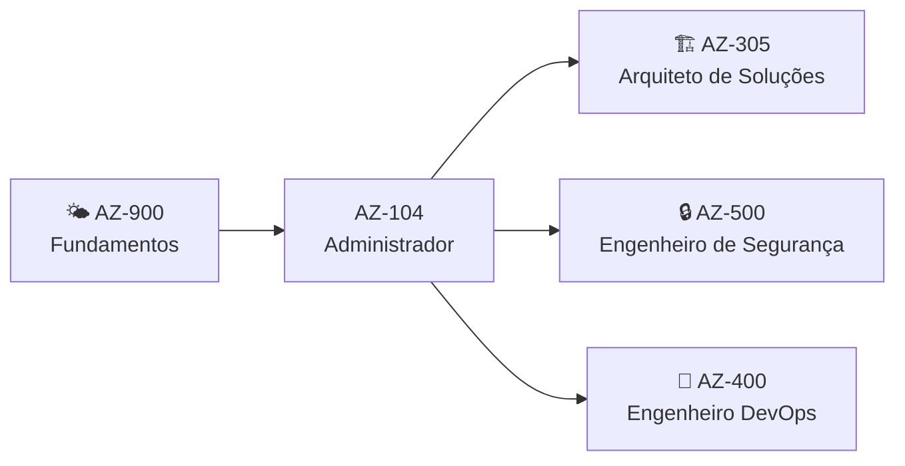

# AZ-104: Azure Administrator | Visão Geral do Exame

> **Versão do exame**: Habilidades medidas a partir de 17 de abril de 2026 | **Nota de aprovação**: 700/1000 | **Duração**: ~100-120 minutos

## Para quem é este exame?

Como candidato a esta certificação, você deve ter experiência na implementação, gerenciamento e monitoramento do ambiente Microsoft Azure de uma organização, incluindo redes virtuais, armazenamento, computação, identidade, segurança e governança.

## Habilidades em Resumo

| Domínio | Peso | Desafios |
|---------|------|----------|
| 🔐 Gerenciar identidades e governança do Azure | 20–25% | 01, 02, 03 |
| 💾 Implementar e gerenciar armazenamento | 15–20% | 04, 05, 06 |
| ⚙️ Implantar e gerenciar recursos de computação do Azure | 20–25% | 07, 08, 09, 10 |
| 🌐 Implementar e gerenciar redes virtuais | 15–20% | 11, 12, 13 |
| 📊 Monitorar e manter recursos do Azure | 10–15% | 14, 15 |
| 🏆 Capstone entre domínios | | | 16 |

## Como Este Site Funciona

Cada desafio segue um formato consistente:

1. **Introdução** | Cenário do mundo real que contextualiza o desafio
2. **Habilidades do Exame Cobertas** | Tópicos exatos do guia de estudo oficial
3. **Descrição** | Sua missão com tarefas passo a passo
4. **Critérios de Sucesso** | Definição clara de "concluído"
5. **Abas Multi-Ferramenta** | Instruções para Azure CLI, PowerShell e Portal
6. **Dicas** | Dicas expansíveis caso você fique travado
7. **Quebre & Conserte** | Cenários de solução de problemas com configurações incorretas intencionais
8. **Verificação de Conhecimento** | Questões no estilo do exame para você se testar
9. **Limpeza** | Scripts para excluir recursos e evitar custos

## Pré-requisitos

- **Assinatura do Azure** | [Conta Gratuita do Azure](https://azure.microsoft.com/free/) (crédito de $200 por 30 dias) ou [Azure para Estudantes](https://azure.microsoft.com/free/students/) (crédito de $100, sem cartão de crédito)
- **Familiaridade com** | Sistemas operacionais, noções básicas de redes, servidores, virtualização
- **Experiência com** | Azure Portal, ferramentas de linha de comando (CLI ou PowerShell)

:::tip Dica

Laboratório com um clique | Sem necessidade de configuração! [Abra no GitHub Codespaces](https://codespaces.new/azurecertprep/azurecertprep.github.io?quickstart=1) e tenha Azure CLI, Bicep e PowerShell prontos em minutos. Gratuito por 60h/mês.

:::
## Recursos de Estudo

| Recurso | Link |
|---------|------|
| Guia de Estudo Oficial | [Guia de Estudo AZ-104](https://learn.microsoft.com/en-us/credentials/certifications/resources/study-guides/az-104) |
| Avaliação Prática Gratuita | [Questões Práticas](https://learn.microsoft.com/en-us/credentials/certifications/exams/az-104/practice/assessment?assessment-type=practice&assessmentId=21) |
| Sandbox do Exame | [Experimente a interface do exame](https://aka.ms/examdemo) |
| Trilha de Aprendizado Microsoft Learn | [Trilha de Aprendizado AZ-104](https://learn.microsoft.com/en-us/credentials/certifications/exams/az-104) |
| Agendar o Exame | [Pearson VUE](https://learn.microsoft.com/en-us/credentials/certifications/azure-administrator/) |

## Trilha de Aprendizado

---

**Pronto?** Comece com a autoavaliação [Estou Pronto?](/docs/az-104/self-assessment) ou vá direto para a [Configuração do Laboratório](/docs/az-104/lab-setup).
