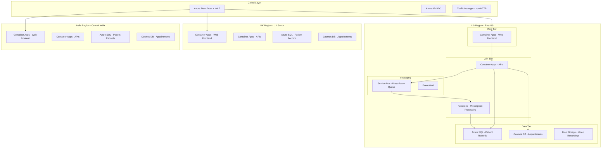

import SuccessChecklist from '@site/src/components/SuccessChecklist';

# Desafio 50: projetar uma solução Azure completa

:::info Tempo Estimado e Custo

**120-180 min** | **Custo estimado**: $15-40 | **Peso no Exame: TODOS OS DOMINIOS**

:::

## Introdução

A MediCorp é uma empresa de tecnologia em saúde lancando uma nova plataforma de telemedicina que atendera 500.000 pacientes e 5.000 medicos em 3 paises: Estados Unidos, Reino Unido e India. A plataforma habilitara consultas por vídeo, gerenciara prontuarios de pacientes, processara prescricoes, lidara com agendamento de consultas é fornecera dashboards de analytics em tempo real.

Esta é uma implantacao greenfield com cronogramas agressivos (MVP em 6 meses, lancamento completo em 12 meses) e requisitos rigorosos em toda dimensão arquitetural. A plataforma deve estar em conformidade com HIPAA (EUA), UK GDPR (Reino Unido) e a Lei de Proteção de Dados Pessoais Digitais da India. Todas as informações de saúde do paciente (PHI) devem ser criptografadas em repouso e em transito, o acesso deve ser auditado e os dados devem residir na região onde o paciente esta localizado.

Os requisitos de negocio incluem:
- **Consultas por Video**: Video em tempo real com baixa latência entre paciente e medico, gravado para conformidade e potencial resolução de disputas. Deve suportar 5.000 sessões de vídeo simultaneas no pico.
- **Prontuarios de Pacientes (EHR)**: Prontuarios eletronicos de saúde acessiveis apenas por medicos autorizados, com trilha de auditoria completa de cada acesso. 500.000 prontuarios de pacientes com histórico medico, resultados de laboratório, referências de exames de imagem.
- **Sistema de Prescricoes**: Garantia de processamento exactly-once (sem prescricoes duplicadas), integrado com sistemas de farmacias via API, trilha de auditoria completa para conformidade regulatoria.
- **Agendamento de Consultas**: Alta disponibilidade (sem ponto único de falha), lida com 10.000 usuários simultaneos durante horarios de pico matinais de agendamento, suporta múltiplos fusos horarios.
- **Dashboard de Analytics**: Metricas em tempo real mostrando tempos de espera de pacientes, taxas de utilizacao de medicos, duracao de consultas e saúde da plataforma. Usado pela equipe de operações para planejamento de capacidade.
- **SLA**: 99,99% de disponibilidade para o caminho crítico (agendamento de consulta até a consulta até a prescricao)
- **Recuperação de Desastres**: RPO 5 segundos, RTO 2 minutos para sistemas críticos (agendamento, consulta, prescricao)
- **Orcamento**: $50.000/mes de gasto total no Azure
- **Segurança**: Sem endpoints públicos para serviços backend, todos os segredos no Key Vault, managed identity para toda autenticação serviço-a-serviço, arquitetura de rede zero-trust

Este desafio capstone integra todos os 4 dominios do exame: Identidade/Governança/Monitoramento, Armazenamento de Dados, Continuidade de Negocios e Infraestrutura. Projete a arquitetura completa.

## Habilidades do exame cobertas

- Projetar soluções para logging e monitoramento
- Projetar soluções de autenticação e autorização
- Projetar governança
- Projetar soluções de armazenamento de dados para dados relacionais
- Projetar soluções de armazenamento de dados para dados semi-estruturados e não estruturados
- Projetar soluções para backup e recuperação de desastres
- Projetar para alta disponibilidade
- Recomendar uma solução de computacao baseada em requisitos de workload
- Recomendar uma arquitetura de mensageria
- Recomendar uma solução de caching para aplicações
- Recomendar uma solução de conectividade que conecte recursos Azure a internet
- Recomendar uma solução para otimizar a segurança de rede
- Recomendar uma solução de balanceamento de carga e roteamento

## Tarefas de design

### Parte 1: identidade, governança e monitoramento (Dominio 1)

1. Projete a arquitetura de identidade:
   - Autenticação de pacientes: Azure AD B2C com autenticação multifator, provedores de identidade social, redefinicao de senha self-service
   - Autenticação de medicos: Entra ID com Conditional Access (exigir dispositivo compatível, MFA, restringir a locais aprovados)
   - Serviço-a-serviço: Managed Identity para todos os serviços Azure (sem credenciais no código)
   - Autorização: Controle de acesso baseado em função (pacientes veem seus próprios prontuarios, medicos veem pacientes atribuidos, admin ve analytics)
2. Projete a estrutura de governança:
   - Layout de management group e assinatura (assinaturas separadas para produção/não-produção, ou por região?)
   - Atribuicoes de Azure Policy: aplicar criptografia, restringir endpoints públicos, exigir diagnostic settings, aplicar tagging
   - Convencao de nomenclatura de recursos e estratégia de tagging (alocacao de custos por departamento, ambiente, escopo de conformidade)
3. Projete a estratégia de monitoramento e observabilidade:
   - Application Insights para cada microsservico (rastreamento distribuido entre serviços de vídeo, agendamento, prescricao)
   - Estratégia de workspace Log Analytics (workspace único vs. por região para conformidade de residencia de dados)
   - Alertas Azure Monitor para rastreamento de SLA (disponibilidade, latência, taxa de erro por serviço)
   - Dashboards customizados para equipe de operações (tempos de espera de pacientes em tempo real, utilizacao de medicos, saúde da plataforma)
   - Audit logging para conformidade (quem acessou qual prontuario de paciente, quando, de onde)

### Parte 2: design de armazenamento de dados (Dominio 2)

4. Projete a arquitetura de armazenamento de dados para cada tipo de dado:
   - Prontuarios de pacientes (estruturados, relacionais): Azure SQL Database ou Cosmos DB? Considere padrões de consulta, requisitos de consistência e necessidades multi-região
   - Gravacoes de vídeo (blobs grandes, write-once): Azure Blob Storage com políticas de imutabilidade para conformidade
   - Dados de agendamento (alto throughput de leitura/escrita, multi-região): Cosmos DB com nível de consistência apropriado
   - Trilha de auditoria de prescricoes (append-only, alta escrita, retencao regulatoria): Cosmos DB ou Azure Table Storage?
   - Dados de analytics (series temporais, agregacoes): Azure Data Explorer ou store de analytics dedicado
5. Projete a estratégia de residencia de dados:
   - Dados de pacientes dos EUA na região East US
   - Dados de pacientes do Reino Unido na região UK South
   - Dados de pacientes da India na região Central India
   - Acesso cross-region de medicos (um medico dos EUA consultando um paciente do Reino Unido - como os dados sao servidos?)
6. Projete a proteção de dados:
   - Criptografia em repouso (chaves gerenciadas pelo cliente no Key Vault para PHI)
   - Criptografia em transito (TLS 1.3 mínimo para todas as conexões)
   - Mascaramento de dados para ambientes de não-produção
   - Políticas de backup e retencao (retencao de 7 anos para prontuarios medicos conforme regulamentacao)

### Parte 3: design de continuidade de negocios (Dominio 3)

7. Projete a arquitetura de alta disponibilidade para SLA de 99,99%:
   - Calcule o SLA composto entre todos os serviços no caminho crítico
   - Identifique pontos únicos de falha e elimine-os
   - Multi-região ativo-ativo para serviços de agendamento e consulta
   - Implantacoes zone-redundant para todos os serviços stateful
8. Projete a estratégia de recuperação de desastres:
   - RPO 5 segundos: qual método de replicação de dados alcanca isso? (Cosmos DB multi-region write, Azure SQL active geo-replication com async commit)
   - RTO 2 minutos: qual mecanismo de failover alcanca isso? (Azure Front Door health probes, automated failover groups)
   - Documente a sequência de failover para o caminho crítico: reroteamento DNS, failover de banco de dados, re-estabelecimento de sessão
9. Projete a estratégia de backup para cada store de dados:
   - Azure SQL: backups automatizados, point-in-time restore, retencao de longo prazo (7 anos)
   - Cosmos DB: modo de backup continuo com point-in-time restore
   - Blob Storage: soft delete, versionamento, políticas de imutabilidade para conformidade
   - Documente RPO/RTO para sistemas não críticos (analytics: RPO 1 hora, RTO 4 horas)

### Parte 4: design de infraestrutura e computação (Dominio 4)

10. Projete a arquitetura de computacao:
    - Serviço de consulta por vídeo: qual plataforma de computacao lida com 5.000 sessões WebRTC simultaneas? (Azure Communication Services ou servidor de midia customizado no AKS?)
    - API de agendamento de consultas: alta concorrencia, stateless (Azure Container Apps com autoscaling?)
    - Processamento de prescricoes: semantica exactly-once, ordenacao de mensagens (Azure Functions com Service Bus?)
    - Trabalhos em segundo plano: transcodificacao de vídeo, geracao de relatórios (Azure Container Apps jobs ou Azure Batch?)
11. Projete a arquitetura de mensageria e eventos:
    - Eventos de agendamento: paciente agenda, medico confirma, lembrete enviado (Event Grid ou Service Bus?)
    - Workflow de prescricao: solicitacao -> validar -> aprovar -> enviar para farmacia (Service Bus com sessions para ordenacao)
    - Eventos de gravacao de vídeo: consulta termina -> gravacao salva -> transcricao acionada -> armazenada (Event Grid + Storage Events)
12. Projete a arquitetura de rede:
    - Azure Front Door para balanceamento de carga global com WAF
    - Private Endpoints para todos os serviços PaaS
    - VNet integration para Container Apps e Functions
    - Segmentacao de rede: camada web, camada de API, camada de dados com NSGs
    - Sem exposicao pública a internet para nenhum serviço backend

### Parte 5: diagrama de arquitetura

13. Crie um diagrama de arquitetura abrangente (usando o bloco de diagrama Mermaid abaixo como template inicial) que mostre:
    - Todos os serviços Azure selecionados
    - Limites de rede e zonas de segurança
    - Fluxo de dados para o caminho crítico (agendamento -> consulta -> prescricao)
    - Topologia de implantacao multi-região
    - Limites de identidade e controle de acesso



### Parte 6: avaliação do Well-Architected Framework

14. Avalie seu design contra cada pilar do Azure Well-Architected Framework:

**Pilar de Confiabilidade:**
- Como a arquitetura alcanca SLA de 99,99%?
- O que acontece quando uma região falha? Documente a sequência de failover.
- Existem pontos únicos de falha remanescentes?

**Pilar de Segurança:**
- Como os dados de pacientes sao protegidos (criptografia, controle de acesso, isolamento de rede)?
- Como zero-trust e implementado (verificar explicitamente, menor privilegio, assumir violacao)?
- Como os requisitos de conformidade (HIPAA, GDPR) sao abordados arquiteturalmente?

**Pilar de Otimização de Custos:**
- O design cabe no orcamento de $50K/mes?
- Quais estratégias de auto-scaling reduzem custos fora dos horarios de pico?
- Onde instâncias reservadas ou savings plans podem reduzir custos de computacao?

**Pilar de Excelencia Operacional:**
- Como a plataforma e implantada e atualizada (CI/CD, blue-green, canary)?
- Como a equipe de operações detecta e responde a incidentes?
- Quais runbooks existem para cenários de falha comuns?

**Pilar de Eficiência de Performance:**
- Como a latência da consulta por vídeo e minimizada para chamadas entre paises?
- Como o agendamento de consultas lida com 10.000 usuários simultaneos?
- Qual estratégia de caching reduz a carga no banco de dados?

### Parte 7: estimativa de custos

15. Produza uma estimativa de custo mensal dividida por categoria de serviço:
    - Computação (Container Apps, Functions, AKS se usado)
    - Dados (Azure SQL, Cosmos DB, Blob Storage)
    - Rede (Front Door, VPN/ExpressRoute, egress de largura de banda)
    - Segurança (DDoS Protection, WAF, Key Vault)
    - Monitoramento (Application Insights, Log Analytics)
    - Identidade (transações Azure AD B2C)
    - Verifique que o total cabe no orcamento de $50K/mes
    - Identifique oportunidades de otimização de custos (capacidade reservada, autoscale-to-zero, armazenamento em camadas)

## Criterios de sucesso

<SuccessChecklist
  storageKey="az305-challenge-50"
  items={[
    "Arquitetura de identidade cobre autenticação B2C de pacientes, autenticação Entra ID de medicos e managed identity para serviço-a-serviço com RBAC",
    "Design de armazenamento de dados aborda dados relacionais (SQL), documentos (Cosmos DB), blob e analytics com aplicação de residencia de dados",
    "Design de alta disponibilidade alcanca SLA composto de 99,99% sem pontos únicos de falha no caminho crítico",
    "Design de DR atende RPO 5 segundos e RTO 2 minutos com sequência de failover documentada para sistemas críticos",
    "Arquitetura de rede aplica zero endpoints públicos para serviços backend com Private Endpoints e VNet integration",
    "Diagrama de arquitetura mostra todos os serviços, limites de rede, fluxo de dados e topologia multi-região"
  ]}
/>

## Dicas

<details>
<summary>Dica 1: Calculo de SLA Composto</summary>

Para SLA composto de 99,99%, cada serviço no caminho crítico deve exceder 99,99% individualmente, ou você deve adicionar redundância. O SLA do Azure Container Apps e 99,95%, Azure SQL Business Critical e 99,995%, Cosmos DB multi-região e 99,999%, Service Bus Premium e 99,9%. O SLA do caminho crítico = produto de todos os serviços: 0,9995 x 0,99995 x 0,99999 x 0,999 = aproximadamente 99,84%. Para alcancar 99,99%, adicione redundância multi-região para os elos mais fracos (Container Apps em 2 regiões com Front Door = 1 - (1 - 0,9995)^2 = 99,999975%).

</details>

<details>
<summary>Dica 2: Arquitetura de Consulta por Video</summary>

O Azure Communication Services (ACS) fornece capacidades gerenciadas de vídeo, voz e chat em tempo real. Ele lida com a complexidade do WebRTC (servidores TURN/STUN, adaptacao de largura de banda, gravacao). Para 5.000 sessões simultaneas, o ACS escala automaticamente. A gravacao é armazenada no Azure Blob Storage. Alternativamente, se você precisa de processamento de midia customizado, implante um servidor de midia no AKS, mas isso requer esforco operacional significativo. Para a maioria dos cenários de telemedicina, ACS e a abordagem recomendada pois fornece vídeo elegivel para HIPAA com gravacao e recursos de conformidade integrados.

</details>

<details>
<summary>Dica 3: Processamento de Prescricoes Exactly-Once</summary>

O processamento verdadeiramente exactly-once requer handlers de mensagens idempotentes combinados com PeekLock do Service Bus e deduplicacao. Design: (1) Solicitacao de prescricao publicada na fila do Service Bus com um PrescriptionId único, (2) Function acionada pela fila pega a mensagem, (3) Function verifica se o PrescriptionId já foi processado (verificação de idempotencia contra o banco de dados), (4) Se novo, processa e completa a mensagem; se duplicado, completa sem processar, (5) Se o processamento falhar, a mensagem retorna a fila apos o lock expirar e é retentada. Habilite detecção de duplicatas no Service Bus (janela de deduplicacao por MessageId) para deduplicacao no lado de publicacao.

</details>

<details>
<summary>Dica 4: Residencia de Dados com Acesso Multi-Região</summary>

Armazene dados de pacientes na região do paciente (obrigatório para GDPR/HIPAA). Quando um medico dos EUA precisa ver o prontuario de um paciente do Reino Unido, a API na região dos EUA faz uma chamada cross-region para a API da região do Reino Unido (não diretamente para o banco de dados do Reino Unido). Isso mantem o acesso aos dados auditavel, garante que os dados não se repliquem fora de sua região e permite políticas de autorização específicas por região. Use o Azure Front Door para rotear requisicoes de pacientes para sua região de origem com base em regras de roteamento geográfico ou claims de autenticação (pais de registro do paciente).

</details>

<details>
<summary>Dica 5: Otimização de Orcamento para $50K/mes</summary>

Principais direcionadores de custo nesta arquitetura: Cosmos DB multi-região (use autoscale para minimizar custos de RU), Azure SQL Business Critical (considere General Purpose com zone redundancy para regiões não críticas), Container Apps (scale to zero para horarios fora do pico), armazenamento de gravacoes de vídeo (use Cool/Archive tier apos 30 dias), Azure Communication Services (cobranca por minuto para vídeo). Use a Calculadora de Precos Azure para estimar: espere aproximadamente $15K computacao, $15K dados, $8K rede/segurança, $5K monitoramento, $7K outros serviços. Capacidade reservada para workloads previsiveis (SQL, Cosmos DB) pode economizar 30-40%.

</details>

## Recursos de aprendizagem

- [Azure Well-Architected Framework](https://learn.microsoft.com/en-us/azure/well-architected/)
- [Azure Architecture Center - Healthcare](https://learn.microsoft.com/en-us/azure/architecture/industries/healthcare)
- [Azure Communication Services overview](https://learn.microsoft.com/en-us/azure/communication-services/overview)
- [Azure AD B2C overview](https://learn.microsoft.com/en-us/azure/active-directory-b2c/overview)
- [Cosmos DB multi-region writes](https://learn.microsoft.com/en-us/azure/cosmos-db/how-to-multi-master)
- [Azure SQL auto-failover groups](https://learn.microsoft.com/en-us/azure/azure-sql/database/auto-failover-group-overview)
- [HIPAA compliance on Azure](https://learn.microsoft.com/en-us/azure/compliance/offerings/offering-hipaa-us)
- [Azure Front Door with Private Link origins](https://learn.microsoft.com/en-us/azure/frontdoor/private-link)

## Verificação de conhecimento

<details>
<summary>1. Sua arquitetura usa Cosmos DB com multi-region writes para agendamento de consultas (SLA de 99,999%) e Azure Container Apps para a camada de API (SLA de 99,95%). O caminho crítico passa por ambos. Qual é o SLA composto e como você o melhora?</summary>

**O SLA composto e 99,949% (0,99999 x 0,9995).** O SLA do Container Apps e o gargalo. Para alcancar 99,99%: implante Container Apps em 2 regiões com roteamento do Azure Front Door. A disponibilidade efetiva do Container Apps se torna 1 - (1 - 0,9995)^2 = 99,999975%. Novo SLA composto: 0,99999975 x 0,99999 = 99,999%. Isso excede a meta de 99,99%. O principio: o SLA mais fraco em uma cadeia serial determina o composto; adicionar redundância paralela para o elo mais fraco melhora dramaticamente a disponibilidade geral.

</details>

<details>
<summary>2. Os prontuarios de um paciente do Reino Unido estao armazenados no UK South. Um medico na India precisa acessar esses prontuarios para uma consulta de emergencia. Sua política de residencia de dados impede a replicação de dados de pacientes do Reino Unido para a India. Como você arquiteta esse acesso?</summary>

**A camada de API da India faz uma chamada de API cross-region autenticada para a camada de API do Reino Unido, que le do banco de dados do Reino Unido.** Fluxo: (1) Medico na India autentica e solicita prontuario do paciente, (2) API da India determina que a residencia de dados e do Reino Unido, (3) API da India chama API do Reino Unido (autenticação serviço-a-serviço via managed identity), (4) API do Reino Unido verifica autorização (medico esta atribuido a este paciente, override de emergencia e válido), (5) API do Reino Unido retorna dados para API da India, (6) API da India transmite para o medico. Os dados nunca deixam o armazenamento do Reino Unido; apenas a resposta da API cruza regiões. Isso mantem a conformidade de residencia de dados enquanto habilita acesso global. O log de auditoria captura o evento de acesso cross-region.

</details>

<details>
<summary>3. Durante os horarios de pico matinais (8-10h em 3 fusos horarios), o agendamento de consultas lida com 10.000 usuários simultaneos. Até as 14h, o trafego cai para 500 usuários simultaneos. Como você projeta para eficiência de custos mantendo a performance?</summary>

**Use Container Apps com autoscaling baseado em HTTP e scale-to-zero para componentes não críticos.** Design: (1) Container Apps com min replicas = 3 (garante disponibilidade baseline) e max replicas = 50 (lida com pico), KEDA HTTP scaler baseado em requisicoes simultaneas, (2) Cosmos DB autoscale (defina max RU/s para pico, escala automaticamente para baixo até 10% fora do pico, cobrado por consumo real), (3) Azure SQL serverless para bancos de analytics (auto-pause apos 1 hora de inatividade), (4) Estratégia de pré-aquecimento: regra de scaling agendada que aumenta min replicas para 10 as 7:30 em cada fuso horario para evitar latência de cold-start durante o ramp-up matinal.

</details>

<details>
<summary>4. O sistema de prescricoes requer entrega exactly-once, mas sua function consumidora do Service Bus ocasionalmente falha no meio do processamento (apos escrever no banco de dados mas antes de completar a mensagem). Como você previne prescricoes duplicadas?</summary>

**Implemente processamento idempotente com uma tabela de deduplicacao.** Design: (1) Mensagem do Service Bus contem um PrescriptionId único, (2) Antes de processar, a function verifica uma tabela de Prescricoes para um registro existente com aquele PrescriptionId (guarda de idempotencia), (3) Se encontrado, a prescricao já foi processada em uma tentativa anterior - complete a mensagem sem re-processar, (4) Se não encontrado, processe a prescricao dentro de uma transação de banco de dados (insira prescricao + marque como processada), entao complete a mensagem. Adicionalmente, habilite detecção de duplicatas no Service Bus (janela de deduplicacao baseada em MessageId) para prevenir que a mesma solicitacao de prescricao seja enfileirada duas vezes. A combinacao de deduplicacao no lado de publicacao e idempotencia no lado de consumo alcanca semantica efetiva de exactly-once.

</details>

## Limpeza

```bash
# Delete all resources created in this capstone challenge
# IMPORTANT: this challenge may have created resources across multiple regions
az group delete --name rg-az305-challenge50-eastus --yes --no-wait
az group delete --name rg-az305-challenge50-uksouth --yes --no-wait
az group delete --name rg-az305-challenge50-centralindia --yes --no-wait

# Verify no orphaned resources remain
az group list --query "[?starts_with(name, 'rg-az305-challenge50')]" -o table
```
