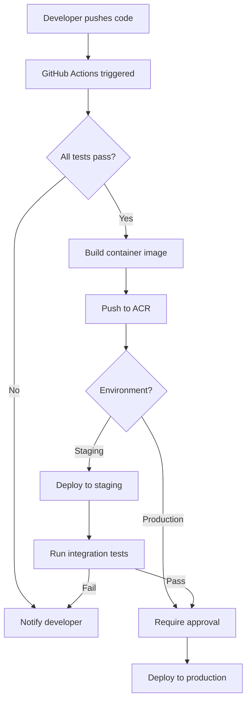
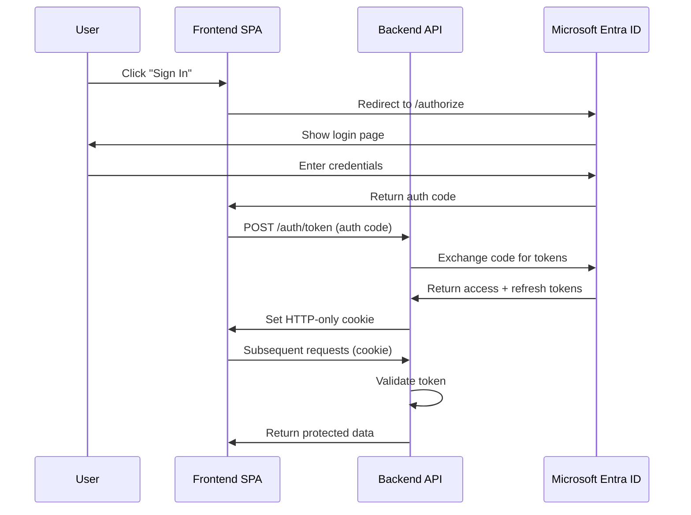
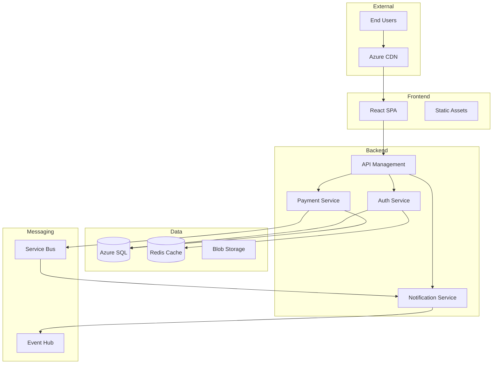
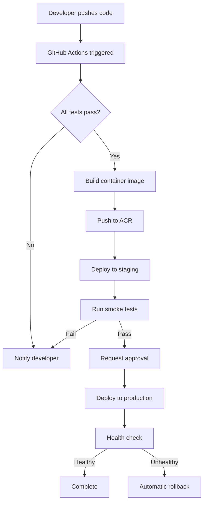
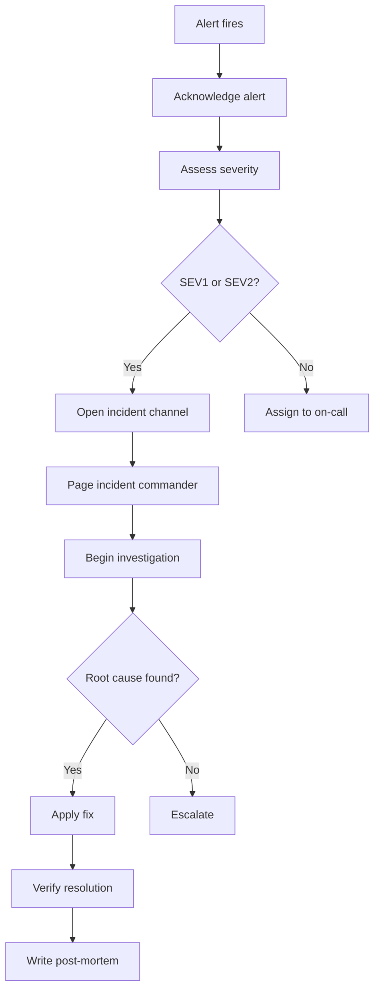

import KnowledgeCheck from '@site/src/components/KnowledgeCheck';


# Desafio 05: Documentação e colaboração

## Habilidades do exame cobertas

- Documentar um projeto configurando wikis e diagramas de processo, incluindo sintaxe Markdown e Mermaid
- Configurar documentação de releases, incluindo notas de release e documentação de API
- Automatizar a criação de documentação a partir do histórico do Git

## Foco da plataforma

Comparação (GitHub e Azure DevOps)

## Cenário

A Contoso Ltd não possui padrões de documentação. Quando um novo desenvolvedor entra, ele passa as duas primeiras semanas fazendo perguntas que deveriam ter sido respondidas pela documentação de onboarding. As notas de release são e-mails manuais que o PM escreve de memória após cada deploy. A documentação da API consiste em documentos Word desatualizados em um site SharePoint que ninguém atualiza. Os diagramas de arquitetura foram criados no Visio há três anos e não refletem mais a realidade. O Diretor de Engenharia quer documentação que viva junto com o código, se atualize automaticamente quando possível e siga uma estrutura consistente.

---

## Pré-requisitos

- Um repositório GitHub (`contoso-webapp`) com histórico de desenvolvimento ativo
- Um projeto Azure DevOps com pipelines configurados
- GitHub CLI instalado e autenticado
- Node.js instalado (para ferramentas de documentação)
- Familiaridade básica com sintaxe Markdown

---

## Tarefa 1: Configurar Wiki do Azure DevOps (code wiki vs provisioned wiki)

O Azure DevOps oferece dois tipos de wiki com diferentes casos de uso:

### Provisioned wiki

Uma wiki gerenciada inteiramente dentro do Azure DevOps. Melhor para documentação de equipe que não precisa residir em um repositório de código.

```bash
# Create a provisioned wiki
az devops wiki create \
  --name "Contoso Engineering Wiki" \
  --type projectWiki \
  --org https://dev.azure.com/contoso-org \
  --project "Contoso Web Platform"

# Add a page to the wiki
az devops wiki page create \
  --wiki "Contoso Engineering Wiki" \
  --path "Home" \
  --content "# Contoso Engineering Wiki

Welcome to the Contoso engineering knowledge base.

## Quick links

- [Architecture Overview](/Architecture-Overview)
- [Onboarding Guide](/Onboarding-Guide)
- [API Reference](/API-Reference)
- [Runbooks](/Runbooks)
"

# Add a sub-page
az devops wiki page create \
  --wiki "Contoso Engineering Wiki" \
  --path "Onboarding-Guide" \
  --content "# Onboarding guide

## First week checklist

1. Set up development environment (see [Dev Setup](/Dev-Setup))
2. Complete security training
3. Read the architecture overview
4. Shadow a team member on a PR review
5. Complete your first small task

## Access requests

| System | How to request | Approver |
|--------|----------------|----------|
| GitHub org | IT ticket | Engineering Manager |
| Azure subscription | PIM request | Team Lead |
| Production VPN | Security team | CISO |
"
```

### Code wiki (publicada a partir do repositório)

Uma wiki respaldada por um repositório Git ou uma pasta dentro dele. Melhor para documentação que deve ser versionada junto com o código.

```bash
# Publish a folder from an existing repo as a wiki
az devops wiki create \
  --name "Contoso API Docs" \
  --type codeWiki \
  --repository "contoso-webapp" \
  --mapped-path "/docs" \
  --branch "main" \
  --org https://dev.azure.com/contoso-org \
  --project "Contoso Web Platform"
```

### Principais diferenças

| Aspecto | Provisioned wiki | Code wiki |
|---------|-----------------|-----------|
| Armazenamento | Repositório Git interno do Azure DevOps | Seu repositório |
| Controle de versão | Automático (interno) | Fluxo de trabalho Git padrão |
| Suporte a branches | Branch único | Qualquer branch |
| Revisões por PR para alterações | Não integrado | Processo padrão de PR |
| Controle de acesso | Permissões da wiki | Permissões do repositório |
| Melhor para | Base de conhecimento da equipe | Documentação técnica junto ao código |

---

## Tarefa 2: Criar diagramas Mermaid em Markdown

Diagramas Mermaid são renderizados nativamente no Markdown do GitHub e na Wiki do Azure DevOps. São ideais para manter diagramas sincronizados com o código porque são baseados em texto e permitem comparação de diferenças (diff).

### Fluxograma: pipeline de deploy

````markdown

````

### Diagrama de sequência: fluxo de autenticação

````markdown

````

### Diagrama de arquitetura: visão geral do sistema

````markdown

````

### Adicionar diagramas ao repositório

```bash
mkdir -p docs/architecture

cat > docs/architecture/deployment-pipeline.md << 'EOF'
# Deployment pipeline

The following diagram shows our CI/CD pipeline from code push to production deployment.



## Pipeline stages

| Stage | Duration | Automated |
|-------|----------|-----------|
| Build and test | ~5 min | Yes |
| Container build | ~3 min | Yes |
| Staging deploy | ~2 min | Yes |
| Smoke tests | ~5 min | Yes |
| Production approval | Variable | No (manual gate) |
| Production deploy | ~2 min | Yes |
| Health check | ~1 min | Yes |
EOF

git add docs/
git commit -m "docs: add architecture diagrams with Mermaid"
git push origin main
```

---

## Tarefa 3: Gerar notas de release automaticamente a partir de títulos de PRs

### Usando GitHub release-drafter

```bash
# Create release-drafter configuration
mkdir -p .github

cat > .github/release-drafter.yml << 'EOF'
name-template: 'v$RESOLVED_VERSION'
tag-template: 'v$RESOLVED_VERSION'
template: |
  ## What changed

  $CHANGES

  ## Contributors

  $CONTRIBUTORS

categories:
  - title: 'New features'
    labels:
      - 'enhancement'
      - 'feature'
  - title: 'Bug fixes'
    labels:
      - 'bug'
      - 'bugfix'
  - title: 'Performance'
    labels:
      - 'performance'
  - title: 'Security'
    labels:
      - 'security'
  - title: 'Documentation'
    labels:
      - 'documentation'
  - title: 'Dependencies'
    labels:
      - 'dependencies'
  - title: 'Other changes'
    labels:
      - '*'

version-resolver:
  major:
    labels:
      - 'breaking-change'
  minor:
    labels:
      - 'enhancement'
      - 'feature'
  patch:
    labels:
      - 'bug'
      - 'bugfix'
      - 'documentation'
      - 'dependencies'
  default: patch

autolabeler:
  - label: 'documentation'
    files:
      - '*.md'
      - 'docs/**'
  - label: 'bug'
    branch:
      - '/^bugfix\//'
      - '/^fix\//'
  - label: 'enhancement'
    branch:
      - '/^feature\//'
  - label: 'dependencies'
    files:
      - 'package-lock.json'
      - 'package.json'

exclude-labels:
  - 'skip-changelog'
EOF

# Create the workflow to run release-drafter
cat > .github/workflows/release-drafter.yml << 'EOF'
name: Release drafter

on:
  push:
    branches: [main]
  pull_request:
    types: [opened, reopened, synchronize]

permissions:
  contents: read
  pull-requests: write

jobs:
  update-release-draft:
    runs-on: ubuntu-latest
    permissions:
      contents: write
      pull-requests: write
    steps:
      - uses: release-drafter/release-drafter@v6
        env:
          GITHUB_TOKEN: ${{ secrets.GITHUB_TOKEN }}
EOF

git add .github/release-drafter.yml .github/workflows/release-drafter.yml
git commit -m "ci: add release-drafter for automated release notes"
git push origin main
```

### Criando uma release manualmente com notas geradas automaticamente

```bash
# GitHub can auto-generate notes from merged PRs
gh release create v2.4.0 \
  --title "v2.4.0 - Authentication Overhaul" \
  --generate-notes \
  --target main

# Or with a custom notes file
gh release create v2.4.0 \
  --title "v2.4.0 - Authentication Overhaul" \
  --notes-file RELEASE_NOTES.md \
  --target main
```

---

## Tarefa 4: Gerar changelog automaticamente a partir de commits convencionais

### Instalar e configurar conventional-changelog

```bash
# Install the conventional-changelog CLI
npm install --save-dev conventional-changelog-cli

# Generate a changelog from Git history
npx conventional-changelog -p angular -i CHANGELOG.md -s -r 0

# Add a script to package.json
cat > package.json << 'EOF'
{
  "name": "contoso-webapp",
  "version": "2.4.0",
  "scripts": {
    "changelog": "conventional-changelog -p angular -i CHANGELOG.md -s",
    "changelog:all": "conventional-changelog -p angular -i CHANGELOG.md -s -r 0",
    "version": "conventional-changelog -p angular -i CHANGELOG.md -s && git add CHANGELOG.md"
  },
  "devDependencies": {
    "conventional-changelog-cli": "^4.1.0"
  }
}
EOF
```

### Automatizar a geração de changelog no CI

```bash
cat > .github/workflows/changelog.yml << 'EOF'
name: Generate changelog

on:
  push:
    tags:
      - 'v*'

permissions:
  contents: write

jobs:
  changelog:
    runs-on: ubuntu-latest
    steps:
      - uses: actions/checkout@v4
        with:
          fetch-depth: 0

      - name: Setup Node.js
        uses: actions/setup-node@v4
        with:
          node-version: '20'

      - name: Install dependencies
        run: npm install conventional-changelog-cli

      - name: Generate changelog
        run: npx conventional-changelog -p angular -i CHANGELOG.md -s -r 0

      - name: Commit updated changelog
        run: |
          git config user.name "github-actions[bot]"
          git config user.email "github-actions[bot]@users.noreply.github.com"
          git add CHANGELOG.md
          git commit -m "docs: update changelog for ${{ github.ref_name }}" || true
          git push origin HEAD:main
EOF

git add .github/workflows/changelog.yml package.json
git commit -m "ci: add automated changelog generation from conventional commits"
git push origin main
```

### Exemplo de saída do changelog

```markdown
# Changelog

## 2.4.0 (2025-01-20)

### Features

* **auth:** implement SSO login with Microsoft Entra ID (a1b2c3d)
* **auth:** add token refresh logic (d4e5f6a)
* **api:** add rate limiting middleware (b7c8d9e)

### Bug Fixes

* **payments:** correct decimal precision in currency conversion (f0a1b2c)
* **payments:** handle gateway timeout gracefully (c3d4e5f)

### Performance

* **api:** add Redis caching for user sessions (a6b7c8d)

### Breaking Changes

* **api:** change authentication endpoint response format (e9f0a1b)
```

---

## Tarefa 5: Configurar documentação de API com publicação automática Swagger/OpenAPI

### Gerar especificação OpenAPI a partir de anotações no código

```bash
mkdir -p src/api

# Example Express API with JSDoc annotations for swagger-jsdoc
cat > src/api/users.js << 'EOF'
const express = require('express');
const router = express.Router();

/**
 * @openapi
 * /api/users:
 *   get:
 *     summary: List all users
 *     tags: [Users]
 *     parameters:
 *       - in: query
 *         name: page
 *         schema:
 *           type: integer
 *           default: 1
 *         description: Page number
 *       - in: query
 *         name: limit
 *         schema:
 *           type: integer
 *           default: 20
 *         description: Items per page
 *     responses:
 *       200:
 *         description: List of users
 *         content:
 *           application/json:
 *             schema:
 *               type: object
 *               properties:
 *                 data:
 *                   type: array
 *                   items:
 *                     $ref: '#/components/schemas/User'
 *                 pagination:
 *                   $ref: '#/components/schemas/Pagination'
 *       401:
 *         description: Unauthorized
 */
router.get('/', async (req, res) => {
  // implementation
});

/**
 * @openapi
 * /api/users/{id}:
 *   get:
 *     summary: Get user by ID
 *     tags: [Users]
 *     parameters:
 *       - in: path
 *         name: id
 *         required: true
 *         schema:
 *           type: string
 *           format: uuid
 *     responses:
 *       200:
 *         description: User details
 *         content:
 *           application/json:
 *             schema:
 *               $ref: '#/components/schemas/User'
 *       404:
 *         description: User not found
 */
router.get('/:id', async (req, res) => {
  // implementation
});

module.exports = router;
EOF

# Create swagger configuration
cat > src/api/swagger.js << 'EOF'
const swaggerJsdoc = require('swagger-jsdoc');

const options = {
  definition: {
    openapi: '3.0.3',
    info: {
      title: 'Contoso Web Platform API',
      version: '2.4.0',
      description: 'RESTful API for the Contoso web platform',
      contact: {
        name: 'Contoso Engineering',
        email: 'api-support@contoso.com'
      }
    },
    servers: [
      { url: 'https://api.contoso.com', description: 'Production' },
      { url: 'https://api-staging.contoso.com', description: 'Staging' }
    ],
    components: {
      schemas: {
        User: {
          type: 'object',
          properties: {
            id: { type: 'string', format: 'uuid' },
            email: { type: 'string', format: 'email' },
            displayName: { type: 'string' },
            createdAt: { type: 'string', format: 'date-time' }
          }
        },
        Pagination: {
          type: 'object',
          properties: {
            page: { type: 'integer' },
            limit: { type: 'integer' },
            total: { type: 'integer' },
            pages: { type: 'integer' }
          }
        }
      },
      securitySchemes: {
        bearerAuth: {
          type: 'http',
          scheme: 'bearer',
          bearerFormat: 'JWT'
        }
      }
    },
    security: [{ bearerAuth: [] }]
  },
  apis: ['./src/api/*.js']
};

module.exports = swaggerJsdoc(options);
EOF
```

### Publicar documentação da API automaticamente com GitHub Actions

```bash
cat > .github/workflows/api-docs.yml << 'EOF'
name: Publish API documentation

on:
  push:
    branches: [main]
    paths:
      - 'src/api/**'
      - 'openapi.yaml'

permissions:
  contents: read
  pages: write
  id-token: write

jobs:
  build-docs:
    runs-on: ubuntu-latest
    steps:
      - uses: actions/checkout@v4

      - name: Setup Node.js
        uses: actions/setup-node@v4
        with:
          node-version: '20'

      - name: Install dependencies
        run: npm ci

      - name: Generate OpenAPI spec
        run: |
          node -e "
            const spec = require('./src/api/swagger.js');
            const fs = require('fs');
            fs.writeFileSync('openapi.json', JSON.stringify(spec, null, 2));
          "

      - name: Generate HTML documentation
        run: |
          npx @redocly/cli build-docs openapi.json \
            --output docs/api/index.html \
            --title "Contoso API Reference"

      - name: Upload Pages artifact
        uses: actions/upload-pages-artifact@v3
        with:
          path: docs/api

  deploy-docs:
    needs: build-docs
    runs-on: ubuntu-latest
    environment:
      name: github-pages
      url: ${{ steps.deployment.outputs.page_url }}
    steps:
      - name: Deploy to GitHub Pages
        id: deployment
        uses: actions/deploy-pages@v4
EOF

git add .github/workflows/api-docs.yml src/api/
git commit -m "ci: add automated API documentation publishing"
git push origin main
```

---

## Tarefa 6: Configurar GitHub Pages para hospedagem de documentação

### Habilitar GitHub Pages

```bash
# Enable Pages from a branch
gh api repos/{owner}/{repo}/pages \
  --method POST \
  --field source='{"branch":"main","path":"/docs"}' \
  --field build_type="workflow"

# Or configure for GitHub Actions deployment
gh api repos/{owner}/{repo}/pages \
  --method PUT \
  --field source='{"branch":"main","path":"/"}' \
  --field build_type="workflow"

# Verify Pages is enabled
gh api repos/{owner}/{repo}/pages --jq '{url: .html_url, status: .status, build_type: .build_type}'
```

### Criar uma estrutura de site de documentação

```bash
mkdir -p docs/{api,guides,runbooks}

cat > docs/index.md << 'EOF'
# Contoso Web Platform documentation

## Sections

- [Architecture Overview](./architecture/deployment-pipeline.md)
- [API Reference](./api/index.html)
- [Guides](./guides/)
- [Runbooks](./runbooks/)

## Quick start

1. Clone the repository
2. Run `npm install`
3. Run `npm run dev`
4. Open http://localhost:3000

## Contributing to docs

Documentation lives in the `/docs` directory and is published automatically
to GitHub Pages on every push to main. Use Mermaid for diagrams and keep
pages focused on a single topic.
EOF

cat > docs/runbooks/incident-response.md << 'EOF'
# Incident response runbook

## Severity levels

| Level | Description | Response time | Escalation |
|-------|-------------|---------------|------------|
| SEV1 | Service down | 15 minutes | VP Engineering |
| SEV2 | Major degradation | 30 minutes | Engineering Manager |
| SEV3 | Minor impact | 4 hours | Team Lead |
| SEV4 | No user impact | Next business day | Assigned engineer |

## Response steps


EOF

git add docs/
git commit -m "docs: add documentation site structure with runbooks"
git push origin main
```

---

## Exercícios de quebra e conserto

### Cenário 1: Diagramas Mermaid não renderizam na Wiki do Azure DevOps

A Wiki do Azure DevOps suporta Mermaid, mas a sintaxe pode diferir ligeiramente do GitHub.

**Diagnóstico:** Verifique se o bloco de código usa o identificador de linguagem `mermaid` e se nenhum recurso não suportado está sendo usado.


<details>
<summary>Mostrar solução</summary>

**Correção:** O suporte a Mermaid do Azure DevOps pode estar defasado em relação ao GitHub. Evite recursos mais recentes do Mermaid e teste no editor da Wiki do Azure DevOps. O Azure DevOps usa a sintaxe `::: mermaid` (não crases triplas) para renderizar diagramas em páginas wiki.

Exemplo de sintaxe wiki:

    ::: mermaid
    flowchart TD
        A --> B
    :::

</details>

### Cenário 2: Release-drafter produz notas de release vazias

PRs são mergeados, mas o rascunho da release não contém entradas.

**Diagnóstico:**

```bash
# Check if PRs have labels that match the categories
gh pr list --state merged --limit 10 --json number,labels \
  --jq '.[] | {pr: .number, labels: [.labels[].name]}'
```


<details>
<summary>Mostrar solução</summary>

**Correção:** O release-drafter agrupa PRs por label. Se os PRs não possuem labels, eles caem em "Other changes" (se configurado) ou são omitidos. Habilite o autolabeler no `.github/release-drafter.yml` ou adicione labels manualmente aos PRs.

</details>

### Cenário 3: GitHub Pages retorna 404

```bash
# Check if Pages is configured correctly
gh api repos/{owner}/{repo}/pages --jq '.status'

# Check the deployment status
gh api repos/{owner}/{repo}/pages/builds --jq '.[0] | {status, error}'
```


<details>
<summary>Mostrar solução</summary>

**Correção:** Certifique-se de que o branch de origem e o caminho estão corretos. Se estiver usando o tipo de build `workflow`, verifique se o workflow tem as permissões `pages: write` e `id-token: write`.

</details>

## Verificação de conhecimento

<KnowledgeCheck questions={[
  {
    question: "Qual é a principal diferença entre uma provisioned wiki e uma code wiki no Azure DevOps?",
    options: [
      "Provisioned wikis suportam Markdown; code wikis não",
      "Uma provisioned wiki é gerenciada internamente pelo Azure DevOps; uma code wiki é publicada a partir de uma pasta de repositório Git e segue fluxos de trabalho Git padrão",
      "Code wikis são somente leitura; provisioned wikis permitem edição",
      "Provisioned wikis exigem uma licença paga; code wikis são gratuitas"
    ],
    correctIndex: 1,
    explanation: "Uma provisioned wiki é armazenada em um repositório Git interno gerenciado pelo Azure DevOps com seu próprio editor. Uma code wiki publica conteúdo de uma pasta no seu repositório existente, o que significa que as alterações passam por pull requests e revisão de código como qualquer outra alteração de código."
  },
  {
    question: "Qual é a vantagem de usar diagramas Mermaid em vez de diagramas baseados em imagem (PNG/Visio) na documentação?",
    options: [
      "Diagramas Mermaid têm melhor qualidade visual",
      "Diagramas Mermaid são baseados em texto, então podem ser versionados, comparados em PRs e atualizados sem ferramentas externas",
      "Diagramas Mermaid suportam mais formas que o Visio",
      "Diagramas Mermaid são renderizados mais rapidamente nos navegadores"
    ],
    correctIndex: 1,
    explanation: "O formato baseado em texto do Mermaid significa que os diagramas podem ser comparados em pull requests, pesquisados e não requerem ferramentas externas. Quando a arquitetura muda, o diff do diagrama mostra exatamente o que mudou, diferente de arquivos de imagem binários."
  },
  {
    question: "Como o release-drafter determina em qual categoria colocar um pull request?",
    options: [
      "Ele analisa as alterações de código do PR automaticamente",
      "Ele combina as labels do PR com as configurações de labels de categoria no arquivo release-drafter.yml",
      "Ele lê o prefixo do título do PR",
      "Ele usa o milestone ao qual o PR está atribuído"
    ],
    correctIndex: 1,
    explanation: "O release-drafter categoriza PRs combinando suas labels com a configuração de categorias. Cada categoria especifica quais labels mapeiam para ela. PRs sem labels correspondentes são colocados em uma categoria genérica ou omitidos."
  },
  {
    question: "Qual é o propósito da ferramenta 'conventional-changelog'?",
    options: [
      "Ela impõe o formato de mensagem de commit no momento do commit",
      "Ela gera um arquivo CHANGELOG.md estruturado analisando mensagens de Conventional Commits do histórico do Git",
      "Ela valida que todos os commits referenciam itens de trabalho",
      "Ela cria releases no GitHub automaticamente"
    ],
    correctIndex: 1,
    explanation: "O conventional-changelog lê o histórico de commits do Git, analisa mensagens que seguem o formato Conventional Commits e gera um CHANGELOG.md estruturado agrupado por tipo (features, correções, breaking changes) com links para commits."
  }
]} />

## Limpeza

```bash
# Remove documentation tooling
npm uninstall conventional-changelog-cli swagger-jsdoc @redocly/cli
rm -f .github/release-drafter.yml
rm -f .github/workflows/release-drafter.yml
rm -f .github/workflows/changelog.yml
rm -f .github/workflows/api-docs.yml

# Remove docs structure (if desired)
rm -rf docs/api docs/guides docs/runbooks

# Disable GitHub Pages
gh api repos/{owner}/{repo}/pages --method DELETE

# Commit cleanup
git add -A
git commit -m "chore: remove documentation lab artifacts"
git push origin main
```
